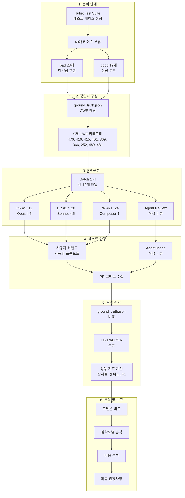
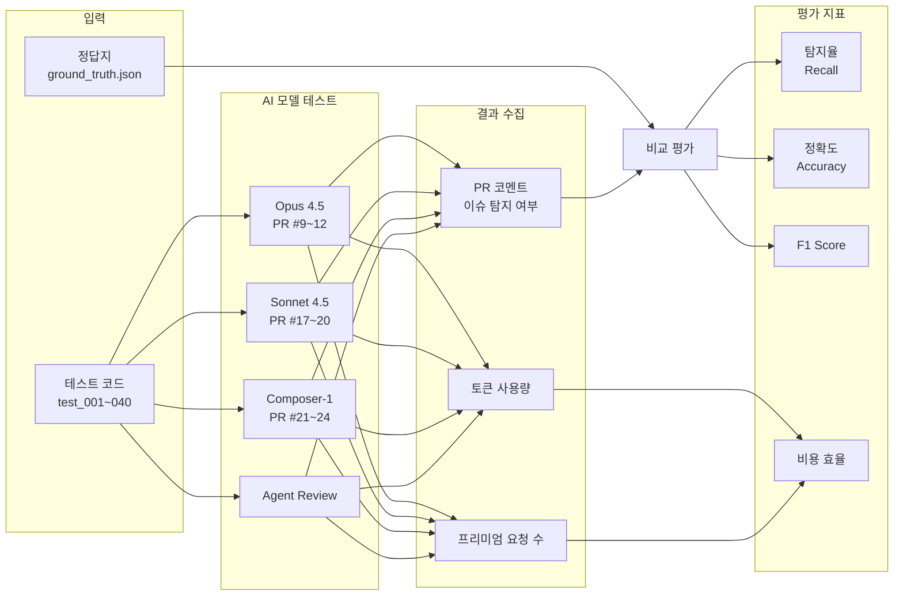
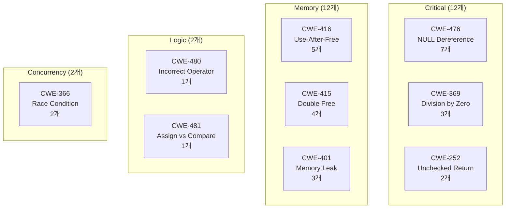

# AI 코드 리뷰 성능 비교 분석 보고서

**작성일**: 2026-01-14 | **테스트 환경**: Cursor IDE | **테스트 대상**: Juliet Test Suite C/C++ 40개 케이스

---

## Executive Summary

### 핵심 결과

| 모델 | 탐지율 | 정확도 | F1 Score | 순위 |
|------|:------:|:------:|:--------:|:----:|
| **Opus 4.5** | **100%** | **95.0%** | **96.6%** | **1위** |
| Sonnet 4.5 | 96.4% | 85.0% | 90.0% | 3위 |
| Composer-1 | 92.9% | 82.5% | 88.1% | 2위 |
| Agent Review | 46.4% | 57.5% | 60.5% | 4위 |

### 주요 발견

1. **Opus 4.5가 최고 성능**: 28개 취약점 100% 탐지, 오탐 최소 (2개)
2. **Agent Review는 보안 검사에 부적합**: 탐지율 46.4%로 절반 이상 미탐
3. **사용자 커맨드 프롬프트 > Agent Review**: 명확한 지시문이 성능 향상에 결정적
4. **Agent Review 비용 주의**: 리뷰 범위 증가 시 프리미엄 요청 3.5배 급증

### 권장 모델

| 사용 시나리오 | 권장 모델 |
|--------------|----------|
| 보안 크리티컬 프로젝트 | **Opus 4.5** |
| 일반 프로젝트 (비용 고려) | Composer-1 |
| 상세 분석 필요 | Sonnet 4.5 |
| 소규모 PR 1차 스크리닝 | Agent Review (제한적) |

---

## 1. 테스트 개요

### 1.1 테스트 목적

Cursor의 4가지 AI 코드 리뷰 방식에 대해 C/C++ 취약점 탐지 성능을 비교 평가

### 1.2 테스트 방식

| 방식 | 모델 | PR 번호 | 설명 |
|------|------|---------|------|
| **Opus 4.5** | claude-4.5-opus-high-thinking | #9~#12 | 사용자 커맨드 자동화 프롬프트 |
| **Sonnet 4.5** | claude-4.5-sonnet | #17~#20 | 사용자 커맨드 자동화 프롬프트 |
| **Composer-1** | composer-1 | #21~#24 | 사용자 커맨드 자동화 프롬프트 |
| **Agent Review** | Cursor Agent Mode | - | 에이전트 모드 직접 PR 리뷰 |

### 1.3 테스트 대상

- **테스트 케이스**: Juliet Test Suite 기반 40개 (test_001 ~ test_040)
- **취약점 케이스 (bad)**: 28개 - 탐지해야 함
- **정상 케이스 (good)**: 12개 - 탐지하면 안 됨

### 1.4 테스트 설계 플로우

### 1.5 테스트 프로세스 상세

### 1.6 CWE 분류 체계

---

## 2. 성능 비교 종합

> **☑ 결론**: Opus 4.5가 모든 지표에서 1위. Agent Review는 탐지율 46.4%로 보안 검사 부적합.

### 2.1 전체 성능 지표

| 지표 | Opus 4.5 | Sonnet 4.5 | Composer-1 | Agent Review |
|------|:--------:|:----------:|:----------:|:------------:|
| True Positive (TP) | 28 | 27 | 26 | 13 |
| True Negative (TN) | 10 | 7 | 7 | 10 |
| False Positive (FP) | 2 | 5 | 5 | 2 |
| False Negative (FN) | 0 | 1 | 2 | 15 |
| **탐지율 (Recall)** | **100%** | 96.4% | 92.9% | 46.4% |
| **오탐방지율 (TNR)** | 83.3% | 58.3% | 58.3% | **83.3%** |
| **정확도 (Accuracy)** | **95.0%** | 85.0% | 82.5% | 57.5% |
| **정밀도 (Precision)** | 93.3% | 84.4% | 83.9% | 86.7% |
| **F1 Score** | **96.6%** | 90.0% | 88.1% | 60.5% |

### 2.2 성능 순위 요약

| 항목 | 1위 | 2위 | 3위 | 4위 |
|------|-----|-----|-----|-----|
| 탐지율 | Opus (100%) | Sonnet (96.4%) | Composer (92.9%) | Agent (46.4%) |
| 오탐방지 | Opus/Agent (83.3%) | - | Sonnet/Composer (58.3%) | - |
| F1 Score | Opus (96.6%) | Sonnet (90.0%) | Composer (88.1%) | Agent (60.5%) |
| 정확도 | Opus (95.0%) | Sonnet (85.0%) | Composer (82.5%) | Agent (57.5%) |

### 2.3 종합 평가 (10점 만점)

| 평가 항목 | Opus 4.5 | Sonnet 4.5 | Composer-1 | Agent Review |
|-----------|:--------:|:----------:|:----------:|:------------:|
| 취약점 탐지율 | 10 | 9 | 8 | 5 |
| 탐지 일관성 | 10 | 9 | 8 | 3 |
| 오탐 방지 | 8 | 6 | 6 | 8 |
| 비용 효율성 | 4 | 2 | 6 | 10 |
| Critical 이슈 집중도 | 10 | 9 | 9 | 7 |
| **종합 점수** | **42점** | **35점** | **37점** | **33점** |
| **순위** | **1위** | **3위** | **2위** | **4위** |

---

## 3. 심각도별 탐지 성능

### 3.1 카테고리별 탐지율

> **☑ 결론**: Opus 4.5만 모든 카테고리 100% 탐지. Agent Review는 Concurrency 완전 미탐.

| 카테고리 | Opus 4.5 | Sonnet 4.5 | Composer-1 | Agent Review |
|----------|:--------:|:----------:|:----------:|:------------:|
| **Critical** (12개) | **100%** | 91.7% | 91.7% | 33.3% |
| **Memory** (12개) | **100%** | **100%** | 91.7% | 50.0% |
| **Logic** (2개) | **100%** | **100%** | **100%** | 50.0% |
| **Concurrency** (2개) | **100%** | **100%** | **100%** | **0.0%** |

### 3.2 CWE별 탐지 일관성

> **☑ 결론**: Agent Review는 CWE-366, CWE-252, CWE-480에서 완전 미탐(0%). 맥락 분석 필요한 취약점에 취약.

| CWE | 취약점 | 케이스 수 | Opus | Sonnet | Composer | Agent |
|-----|--------|:--------:|:----:|:------:|:--------:|:-----:|
| CWE-476 | NULL Dereference | 7 | 100% | 100% | 100% | 42.9% |
| CWE-416 | Use-After-Free | 5 | 100% | 100% | 100% | 40.0% |
| CWE-415 | Double Free | 4 | 100% | 100% | 100% | 50.0% |
| CWE-401 | Memory Leak | 3 | 100% | 100% | 66.7% | 66.7% |
| CWE-369 | Division by Zero | 3 | 100% | 100% | 100% | 33.3% |
| CWE-366 | Race Condition | 2 | 100% | 100% | 100% | **0.0%** |
| CWE-252 | Unchecked Return | 2 | 100% | 50% | 50% | **0.0%** |
| CWE-480 | Incorrect Operator | 1 | 100% | 100% | 100% | **0.0%** |
| CWE-481 | Assign vs Compare | 1 | 100% | 100% | 100% | 100% |

### 3.3 일관성 등급

> **☑ 결론**: Opus만 A등급. Agent Review는 D등급으로 일관성 최하위.

| 등급 | 모델 | 설명 |
|:----:|------|------|
| A | Opus 4.5 | 모든 CWE 100% 탐지 |
| A- | Sonnet 4.5 | CWE-252 제외 완벽 |
| B | Composer-1 | CWE-252, CWE-401 일부 미탐 |
| D | Agent Review | 0%~100% 극심한 편차 |

---

## 4. Agent Review 특성 분석

### 4.1 강점과 한계

> **☑ 결론**: 단순 패턴은 양호하나, Race Condition/Unchecked Return 등 복잡한 취약점은 완전 미탐.

Agent Review는 전체 탐지율이 낮지만, **단순한 Critical 패턴**에서는 상대적으로 양호한 성능을 보입니다.

| CWE 유형 | 패턴 복잡도 | Agent 탐지율 | 평가 |
|----------|:-----------:|:------------:|:----:|
| CWE-481 (Assign vs Compare) | 단순 | 100% | 양호 |
| CWE-401 (Memory Leak) | 중간 | 66.7% | 양호 |
| CWE-416 (Use-After-Free) | 단순~중간 | 60.0% | 보통 |
| CWE-476 (NULL Dereference) | 단순 | 57.1% | 보통 |
| CWE-415 (Double Free) | 단순 | 50.0% | 미흡 |
| CWE-369 (Division by Zero) | 중간 | 33.3% | 미흡 |
| CWE-366 (Race Condition) | 복잡 | **0.0%** | 미탐 |
| CWE-252 (Unchecked Return) | 복잡 | **0.0%** | 미탐 |
| CWE-480 (Incorrect Operator) | 중간 | **0.0%** | 미탐 |

**결론**: 단순하고 명확한 패턴에는 효과적이나, **맥락 분석이 필요한 복잡한 취약점은 탐지 불가**

### 4.2 Batch별 성능 저하 현상

> **☑ 결론**: Batch 3~4에서 성능 급락. 컨텍스트 누적으로 인한 "피로 효과" 추정.

| Batch | 탐지율 | 변화 |
|:-----:|:------:|------|
| Batch 1 | 71.4% | 기준 |
| Batch 2 | 71.4% | 유지 |
| Batch 3 | 28.6% | 급락 (-43%) |
| Batch 4 | 14.3% | 급락 (-57%) |

### 4.3 비용 주의사항

> **⚠ 경고**: 리뷰 범위/깊이 증가 시 프리미엄 요청이 지수적 증가 (Batch 1→4: 3.5배)

| Batch | 토큰 | 프리미엄 요청 | 증가율 |
|:-----:|-----:|:------------:|:------:|
| 1 | 10만 | 1.3 | 기준 |
| 2 | 21.5만 | 2.4 | +85% |
| 3 | 26.6만 | 2.6 | +100% |
| 4 | 50.9만 | 4.6 | **+254%** |

---

## 5. 오탐 (False Positive) 분석

> **☑ 결론**: Opus/Agent 오탐 최소(2개), Sonnet/Composer 오탐 다수(5개). test_006은 모든 모델 공통 오탐.

### 5.1 오탐 발생 현황

| 파일 | 실제 | Opus | Sonnet | Composer | Agent |
|------|------|:----:|:------:|:--------:|:-----:|
| test_006 | good | FP | FP | FP | FP |
| test_013 | good | FP | FP | FP | TN |
| test_020 | good | TN | FP | FP | TN |
| test_026 | good | TN | FP | FP | TN |
| test_033 | good | TN | TN | TN | FP |
| test_036 | good | TN | FP | FP | TN |
| **합계** | - | **2개** | **5개** | **5개** | **2개** |

### 5.2 오탐 패턴

| 모델 | 오탐 수 | 특이사항 |
|------|:-------:|----------|
| Opus 4.5 | 2개 | 최소 오탐 |
| Sonnet 4.5 | 5개 | Undefined 관련 오탐 다수 |
| Composer-1 | 5개 | Sonnet과 동일 패턴 |
| Agent Review | 2개 | test_033 고유 오탐 |

**공통 오탐**: test_006 - free 전 사용하는 정상 패턴을 Memory Leak으로 오탐

---

## 6. 비용 분석

> **☑ 결론**: 비용 효율은 Composer-1 최고. Agent Review는 토큰 적지만 탐지율 낮아 비권장.

### 6.1 리소스 사용량

| 모델 | 총 토큰 | 프리미엄 요청 | 탐지율 | 비용당 효율 |
|------|--------:|:------------:|:------:|:----------:|
| Agent Review | 109만 | 10.9 | 46.4% | 낮음 (권장X) |
| Composer-1 | 230.3만 | 4 | 92.9% | **높음** |
| Opus 4.5 | 356.5만 | 8 | 100% | 중간 |
| Sonnet 4.5 | 1,044.6만 | 4 | 96.4% | 낮음 |

### 6.2 Batch별 토큰 사용량

| 모델 | Batch 1 | Batch 2 | Batch 3 | Batch 4 | 합계 |
|------|--------:|--------:|--------:|--------:|-----:|
| Opus 4.5 | 97.2만 | 126만 | 47.7만 | 85.6만 | 356.5만 |
| Sonnet 4.5 | 140.7만 | 217.1만 | 301.3만 | 385.5만 | 1,044.6만 |
| Composer-1 | 38.4만 | 49.7만 | 51.8만 | 90.4만 | 230.3만 |
| Agent Review | 10만 | 21.5만 | 26.6만 | 50.9만 | 109만 |

### 6.3 프리미엄 요청 비교

| 모델 | Batch 1 | Batch 2 | Batch 3 | Batch 4 | 합계 | 증가율 |
|------|:-------:|:-------:|:-------:|:-------:|:----:|:------:|
| Opus 4.5 | 2 | 2 | 2 | 2 | 8 | 없음 |
| Sonnet 4.5 | 1 | 1 | 1 | 1 | 4 | 없음 |
| Composer-1 | 1 | 1 | 1 | 1 | 4 | 없음 |
| Agent Review | 1.3 | 2.4 | 2.6 | 4.6 | 10.9 | **254%** |

---

## 7. 결론 및 권장사항

> **☑ 최종 결론**: 보안 크리티컬은 Opus, 일반 프로젝트는 Composer, Agent Review는 제한적 사용.

### 7.1 최종 권장 모델

| 시나리오 | 권장 모델 | 이유 |
|----------|----------|------|
| **보안 크리티컬** | Opus 4.5 | 100% 탐지, 최소 오탐, 모든 CWE 완벽 |
| **일반 프로젝트** | Composer-1 | 92.9% 탐지, 비용 효율 최고 |
| **상세 분석 필요** | Sonnet 4.5 | 96.4% 탐지, 오탐 다소 많음 |
| **소규모 PR 스크리닝** | Agent Review | 단순 패턴만, 제한적 사용 |

### 7.2 핵심 인사이트

1. **사용자 커맨드 자동화 프롬프트 > Agent Review**
   - Opus 100% vs Agent 46.4%
   - 명확한 지시문과 구조화된 프롬프트가 성능 향상에 결정적

2. **Agent Review의 한계**
   - Race Condition, Unchecked Return Value 완전 미탐 (0%)
   - Batch 진행 시 성능 급락 (71.4% → 14.3%)
   - 프리미엄 요청 3.5배 급증

3. **공통 오탐 패턴**
   - test_006: 모든 모델이 정상 free 패턴을 Memory Leak으로 오탐

4. **동시성 취약점은 명시적 지시 필요**
   - Agent Review는 Race Condition 0% 탐지
   - 프롬프트에 동시성 검사 명시 시 100% 탐지 가능

---

## 부록 A: 모델별 상세 결과

> **범례**: O=탐지, X=미탐, △=부분탐지, -=탐지 불필요 / TP=True Positive, TN=True Negative, FP=False Positive, FN=False Negative

### A.1 Opus 4.5 (PR #9~#12)

| 테스트 | 정답 | 탐지 | 문제 내용 | 결과 |
|--------|------|:----:|----------|:----:|
| test_001 | bad (CWE-476) | O | NULL Dereference | TP |
| test_002 | bad (CWE-416) | O | Use-After-Free | TP |
| test_003 | good | - | 이슈 없음 | TN |
| test_004 | bad (CWE-415) | O | Double Free | TP |
| test_005 | bad (CWE-369) | O | Division by Zero | TP |
| test_006 | good | O | Memory Leak (오탐) | FP |
| test_007 | bad (CWE-401) | O | realloc 누수 | TP |
| test_008 | bad (CWE-480) | △ | 미정의 변수 (CWE 다름) | TP |
| test_009 | bad (CWE-481) | O | Assignment vs Comparison | TP |
| test_010 | good | - | 이슈 없음 | TN |
| test_011 | bad (CWE-476) | O | NULL Dereference | TP |
| test_012 | bad (CWE-416) | O | Use-After-Free | TP |
| test_013 | good | O | Undefined Macro (컴파일 이슈) | FP |
| test_014 | bad (CWE-366) | O | Race Condition | TP |
| test_015 | bad (CWE-252) | O | Unchecked Return Value | TP |
| test_016 | good | - | 이슈 없음 | TN |
| test_017 | bad (CWE-415) | O | Double Free | TP |
| test_018 | bad (CWE-476) | O | NULL Dereference | TP |
| test_019 | bad (CWE-369) | O | Division by Zero | TP |
| test_020 | good | - | 이슈 없음 | TN |
| test_021 | bad (CWE-416) | O | Use-After-Free | TP |
| test_022 | bad (CWE-401) | O | Memory Leak | TP |
| test_023 | good | - | 이슈 없음 | TN |
| test_024 | bad (CWE-476) | O | NULL Dereference | TP |
| test_025 | bad (CWE-366) | O | Race Condition | TP |
| test_026 | good | - | 이슈 없음 | TN |
| test_027 | bad (CWE-252) | O | Unchecked Return Value | TP |
| test_028 | bad (CWE-415) | O | Double Free | TP |
| test_029 | bad (CWE-416) | O | Use-After-Free | TP |
| test_030 | good | - | 이슈 없음 | TN |
| test_031 | bad (CWE-476) | O | NULL Dereference | TP |
| test_032 | bad (CWE-401) | O | Memory Leak | TP |
| test_033 | good | - | 이슈 없음 | TN |
| test_034 | bad (CWE-369) | O | Division by Zero | TP |
| test_035 | bad (CWE-416) | O | Use-After-Free | TP |
| test_036 | good | - | 이슈 없음 | TN |
| test_037 | bad (CWE-476) | O | NULL Dereference | TP |
| test_038 | bad (CWE-415) | O | Double Free | TP |
| test_039 | good | - | 이슈 없음 | TN |
| test_040 | bad (CWE-476) | O | NULL Dereference | TP |

**요약**: TP 28 / TN 10 / FP 2 / FN 0 | **정확도 95.0%** | **F1 96.6%**

---

### A.2 Sonnet 4.5 (PR #17~#20)

| 테스트 | 정답 | 탐지 | 문제 내용 | 결과 |
|--------|------|:----:|----------|:----:|
| test_001 | bad (CWE-476) | O | NULL Dereference | TP |
| test_002 | bad (CWE-416) | O | Use-After-Free | TP |
| test_003 | good | - | 이슈 없음 | TN |
| test_004 | bad (CWE-415) | O | Double Free | TP |
| test_005 | bad (CWE-369) | O | Division by Zero | TP |
| test_006 | good | O | Memory Leak (오탐) | FP |
| test_007 | bad (CWE-401) | O | realloc 누수 | TP |
| test_008 | bad (CWE-480) | O | Undefined Variable | TP |
| test_009 | bad (CWE-481) | O | Assignment vs Comparison | TP |
| test_010 | good | - | 이슈 없음 | TN |
| test_011 | bad (CWE-476) | O | NULL Dereference | TP |
| test_012 | bad (CWE-416) | O | Use-After-Free | TP |
| test_013 | good | O | Undefined Macro (오탐) | FP |
| test_014 | bad (CWE-366) | O | Race Condition | TP |
| test_015 | bad (CWE-252) | X | 미탐지 | FN |
| test_016 | good | - | 이슈 없음 | TN |
| test_017 | bad (CWE-415) | O | Double Free | TP |
| test_018 | bad (CWE-476) | O | NULL Dereference | TP |
| test_019 | bad (CWE-369) | O | Division by Zero | TP |
| test_020 | good | O | Undefined Function (오탐) | FP |
| test_021 | bad (CWE-416) | O | Use-After-Free | TP |
| test_022 | bad (CWE-401) | O | Memory Leak | TP |
| test_023 | good | - | 이슈 없음 | TN |
| test_024 | bad (CWE-476) | O | NULL Dereference | TP |
| test_025 | bad (CWE-366) | O | Race Condition | TP |
| test_026 | good | O | Undefined Symbols (오탐) | FP |
| test_027 | bad (CWE-252) | O | Unchecked Return Value | TP |
| test_028 | bad (CWE-415) | O | Double Free | TP |
| test_029 | bad (CWE-416) | O | Use-After-Free | TP |
| test_030 | good | - | 이슈 없음 | TN |
| test_031 | bad (CWE-476) | O | NULL Dereference | TP |
| test_032 | bad (CWE-401) | O | Memory Leak | TP |
| test_033 | good | - | 이슈 없음 | TN |
| test_034 | bad (CWE-369) | O | Division by Zero | TP |
| test_035 | bad (CWE-416) | O | Use-After-Free | TP |
| test_036 | good | O | Undefined Function (오탐) | FP |
| test_037 | bad (CWE-476) | O | NULL Dereference | TP |
| test_038 | bad (CWE-415) | O | Double Free | TP |
| test_039 | good | - | 이슈 없음 | TN |
| test_040 | bad (CWE-476) | O | NULL Dereference | TP |

**요약**: TP 27 / TN 7 / FP 5 / FN 1 | **정확도 85.0%** | **F1 90.0%**

---

### A.3 Composer-1 (PR #21~#24)

| 테스트 | 정답 | 탐지 | 문제 내용 | 결과 |
|--------|------|:----:|----------|:----:|
| test_001 | bad (CWE-476) | O | NULL Dereference | TP |
| test_002 | bad (CWE-416) | O | Use-After-Free | TP |
| test_003 | good | - | 이슈 없음 | TN |
| test_004 | bad (CWE-415) | O | Double Free | TP |
| test_005 | bad (CWE-369) | O | Division by Zero | TP |
| test_006 | good | O | Memory Leak (오탐) | FP |
| test_007 | bad (CWE-401) | X | 미탐지 | FN |
| test_008 | bad (CWE-480) | O | Undefined Variable | TP |
| test_009 | bad (CWE-481) | O | Assignment vs Comparison | TP |
| test_010 | good | - | 이슈 없음 | TN |
| test_011 | bad (CWE-476) | O | NULL Dereference | TP |
| test_012 | bad (CWE-416) | O | Use-After-Free | TP |
| test_013 | good | O | Undefined Macro (오탐) | FP |
| test_014 | bad (CWE-366) | O | Race Condition | TP |
| test_015 | bad (CWE-252) | X | 미탐지 | FN |
| test_016 | good | - | 이슈 없음 | TN |
| test_017 | bad (CWE-415) | O | Double Free | TP |
| test_018 | bad (CWE-476) | O | NULL Dereference | TP |
| test_019 | bad (CWE-369) | O | Division by Zero | TP |
| test_020 | good | O | Undefined Function (오탐) | FP |
| test_021 | bad (CWE-416) | O | Use-After-Free | TP |
| test_022 | bad (CWE-401) | O | Memory Leak | TP |
| test_023 | good | - | 이슈 없음 | TN |
| test_024 | bad (CWE-476) | O | NULL Dereference | TP |
| test_025 | bad (CWE-366) | O | Race Condition | TP |
| test_026 | good | O | Undefined Symbols (오탐) | FP |
| test_027 | bad (CWE-252) | O | Unchecked Return Value | TP |
| test_028 | bad (CWE-415) | O | Double Free | TP |
| test_029 | bad (CWE-416) | O | Use-After-Free | TP |
| test_030 | good | - | 이슈 없음 | TN |
| test_031 | bad (CWE-476) | O | NULL Dereference | TP |
| test_032 | bad (CWE-401) | O | Memory Leak | TP |
| test_033 | good | - | 이슈 없음 | TN |
| test_034 | bad (CWE-369) | O | Division by Zero | TP |
| test_035 | bad (CWE-416) | O | Use-After-Free | TP |
| test_036 | good | O | Undefined Function (오탐) | FP |
| test_037 | bad (CWE-476) | O | NULL Dereference | TP |
| test_038 | bad (CWE-415) | O | Double Free | TP |
| test_039 | good | - | 이슈 없음 | TN |
| test_040 | bad (CWE-476) | O | NULL Dereference | TP |

**요약**: TP 26 / TN 7 / FP 5 / FN 2 | **정확도 82.5%** | **F1 88.1%**

---

### A.4 Agent Review

| 테스트 | 정답 | 탐지 | 문제 내용 | 결과 |
|--------|------|:----:|----------|:----:|
| test_001 | bad (CWE-476) | O | NULL Dereference | TP |
| test_002 | bad (CWE-416) | O | Use-After-Free | TP |
| test_003 | good | - | 이슈 없음 | TN |
| test_004 | bad (CWE-415) | O | Double Free | TP |
| test_005 | bad (CWE-369) | X | 미탐지 | FN |
| test_006 | good | O | Memory Leak (오탐) | FP |
| test_007 | bad (CWE-401) | O | realloc 누수 | TP |
| test_008 | bad (CWE-480) | X | 미탐지 | FN |
| test_009 | bad (CWE-481) | O | Assignment vs Comparison | TP |
| test_010 | good | - | 이슈 없음 | TN |
| test_011 | bad (CWE-476) | O | NULL Dereference | TP |
| test_012 | bad (CWE-416) | O | Use-After-Free | TP |
| test_013 | good | - | 이슈 없음 | TN |
| test_014 | bad (CWE-366) | X | Race Condition 미탐지 | FN |
| test_015 | bad (CWE-252) | X | 미탐지 | FN |
| test_016 | good | - | 이슈 없음 | TN |
| test_017 | bad (CWE-415) | O | Double Free | TP |
| test_018 | bad (CWE-476) | O | NULL Dereference | TP |
| test_019 | bad (CWE-369) | O | Division by Zero | TP |
| test_020 | good | - | 이슈 없음 | TN |
| test_021 | bad (CWE-416) | X | Use-After-Free 미탐지 | FN |
| test_022 | bad (CWE-401) | O | Memory Leak | TP |
| test_023 | good | - | 이슈 없음 | TN |
| test_024 | bad (CWE-476) | O | NULL Dereference | TP |
| test_025 | bad (CWE-366) | X | Race Condition 미탐지 | FN |
| test_026 | good | - | 이슈 없음 | TN |
| test_027 | bad (CWE-252) | X | Unchecked Return 미탐지 | FN |
| test_028 | bad (CWE-415) | X | Double Free 미탐지 | FN |
| test_029 | bad (CWE-416) | X | Use-After-Free 미탐지 | FN |
| test_030 | good | - | 이슈 없음 | TN |
| test_031 | bad (CWE-476) | X | NULL Dereference 미탐지 | FN |
| test_032 | bad (CWE-401) | X | Memory Leak 미탐지 | FN |
| test_033 | good | O | Pointer to stack (오탐) | FP |
| test_034 | bad (CWE-369) | X | Division by Zero 미탐지 | FN |
| test_035 | bad (CWE-416) | O | Use-After-Free | TP |
| test_036 | good | - | 이슈 없음 | TN |
| test_037 | bad (CWE-476) | X | NULL Dereference 미탐지 | FN |
| test_038 | bad (CWE-415) | X | Double Free 미탐지 | FN |
| test_039 | good | - | 이슈 없음 | TN |
| test_040 | bad (CWE-476) | X | NULL Dereference 미탐지 | FN |

**요약**: TP 13 / TN 10 / FP 2 / FN 15 | **정확도 57.5%** | **F1 60.5%**

---

## 부록 B: 데이터 소스

### B.1 GitHub Pull Requests

| 모델 | PR 번호 | 링크 |
|------|---------|------|
| Opus 4.5 | #9~#12 | [PR #9](https://github.com/ghlee0308/juliet-test-suite-c_gh/pull/9), [#10](https://github.com/ghlee0308/juliet-test-suite-c_gh/pull/10), [#11](https://github.com/ghlee0308/juliet-test-suite-c_gh/pull/11), [#12](https://github.com/ghlee0308/juliet-test-suite-c_gh/pull/12) |
| Sonnet 4.5 | #17~#20 | [PR #17](https://github.com/ghlee0308/juliet-test-suite-c_gh/pull/17), [#18](https://github.com/ghlee0308/juliet-test-suite-c_gh/pull/18), [#19](https://github.com/ghlee0308/juliet-test-suite-c_gh/pull/19), [#20](https://github.com/ghlee0308/juliet-test-suite-c_gh/pull/20) |
| Composer-1 | #21~#24 | [PR #21](https://github.com/ghlee0308/juliet-test-suite-c_gh/pull/21), [#22](https://github.com/ghlee0308/juliet-test-suite-c_gh/pull/22), [#23](https://github.com/ghlee0308/juliet-test-suite-c_gh/pull/23), [#24](https://github.com/ghlee0308/juliet-test-suite-c_gh/pull/24) |
| Agent Review | - | 테스트결과정리.xlsx |

### B.2 CWE 정답지

| CWE | 취약점 유형 | 케이스 수 | 해당 테스트 |
|-----|------------|:--------:|------------|
| CWE-476 | NULL Pointer Dereference | 7 | test_001, 011, 018, 024, 031, 037, 040 |
| CWE-416 | Use-After-Free | 5 | test_002, 012, 021, 029, 035 |
| CWE-415 | Double Free | 4 | test_004, 017, 028, 038 |
| CWE-401 | Memory Leak | 3 | test_007, 022, 032 |
| CWE-369 | Division by Zero | 3 | test_005, 019, 034 |
| CWE-366 | Race Condition | 2 | test_014, 025 |
| CWE-252 | Unchecked Return Value | 2 | test_015, 027 |
| CWE-480 | Incorrect Operator | 1 | test_008 |
| CWE-481 | Assignment Instead of Comparison | 1 | test_009 |

---

**정답지 파일**: `ai-detection-test/ground_truth.json`
